# AGS Config

These are my config files for Aylur's GTK Shell, a GTK-based desktop shell framework. This is written for Arch Linux with Hyprland and will probably not work on any other distro/compositor without porting.

### Features

**Layouts:**

- Bar
- Dock

**Features:**

- App Launcher: launch an app or calculate something
- OSD (On-Screen Display) for brightness and volume: show a popup when brightness or volume is changed
- Wallpaper: cycle through your wallpapers and select one
- Notification Daemon: recieve & display notifications and expose it through `ags request "notifications"`

**Widgets:**

- Apps: list the open apps and click to go to it or open a list of opened instances if more than one open
- Arch: click to view a list of options inspired by Mac
- Battery: view the battery and click to see how much is charging and how much time to full/empty
- Bluetooth: view the currently connected Bluetooth device and click it to list, scan, and connect to devices
- Brightness: see the brightness, click to open a menu with a slider
- Clock: clock and date
- Keyboard: show fcitx5 keyboard, caps lock, and num lock status
- Notifications: show unread notifications, click it to see all notifications
- Player: show artist and title, optionally cover art (with alt layout in config.jsonc)
- Volume: show volume, click to open a menu with sliders to change volume and mic volume
- Weather: shows the current temperature and condition
- Wifi: shows connected wifi and strength and click it to list and connect to wifi networks
- Workspaces: lists the workspaces, click to go to it

### Screenshots

<details>
<summary>Bar/Dock Styles</summary>

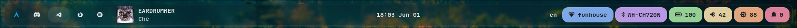<br>
_Bar Style 1 (I use this one)_

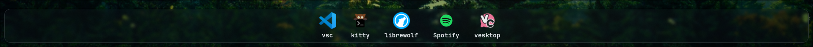
_Dock style 1_

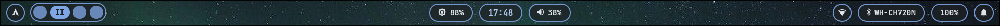<br>
_Bar Style 2 (Made to test out making other styles, replicated dusklinux/dusky)_

<br>
_Dock Style 2_

There are 2 further styles:

1. A copy of [weezlebee's waybar](https://github.com/Weezlebee/hypr-dotfiles), it might be somewhere in his repo
2. Bar style 1 but seperated islands

</details>

<details>
<summary>Popups</summary>

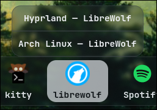<br>
_Apps_

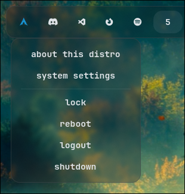<br>
_Arch_

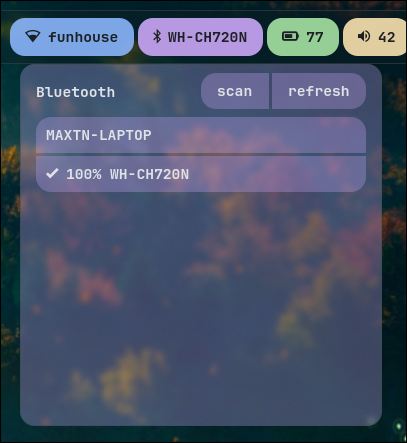<br>
_Bluetooth_

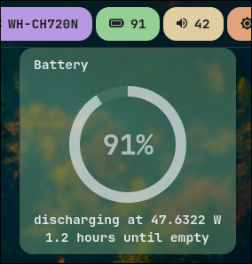<br>
_Battery_

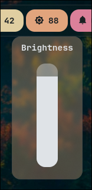<br>
_Brightness_

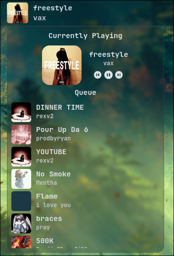<br>
_Player_

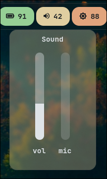<br>
_Volume_

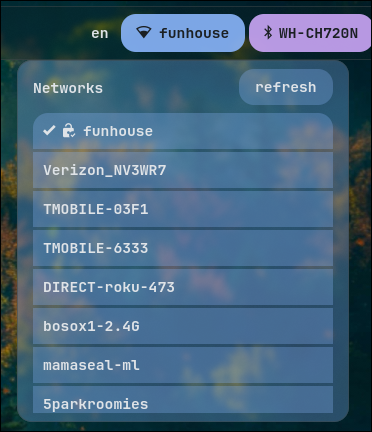<br>
_Wifi_

</details>

<details>
<summary>Features</summary>

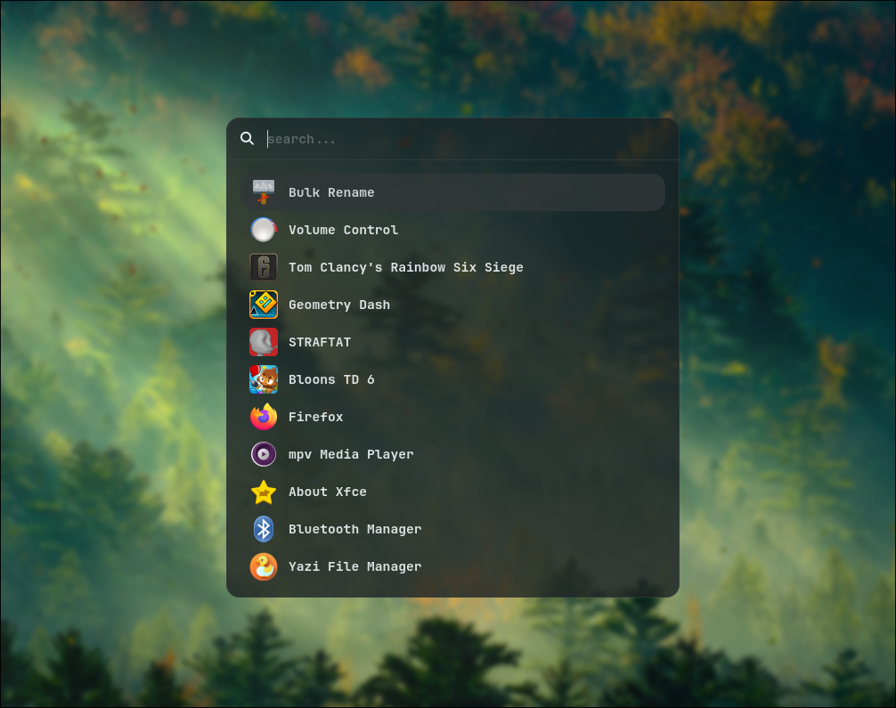

_App Launcher_

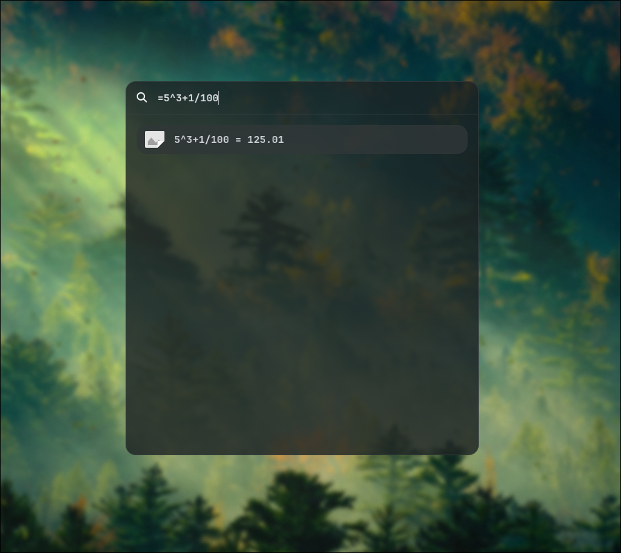

_App Launcher Calculator_

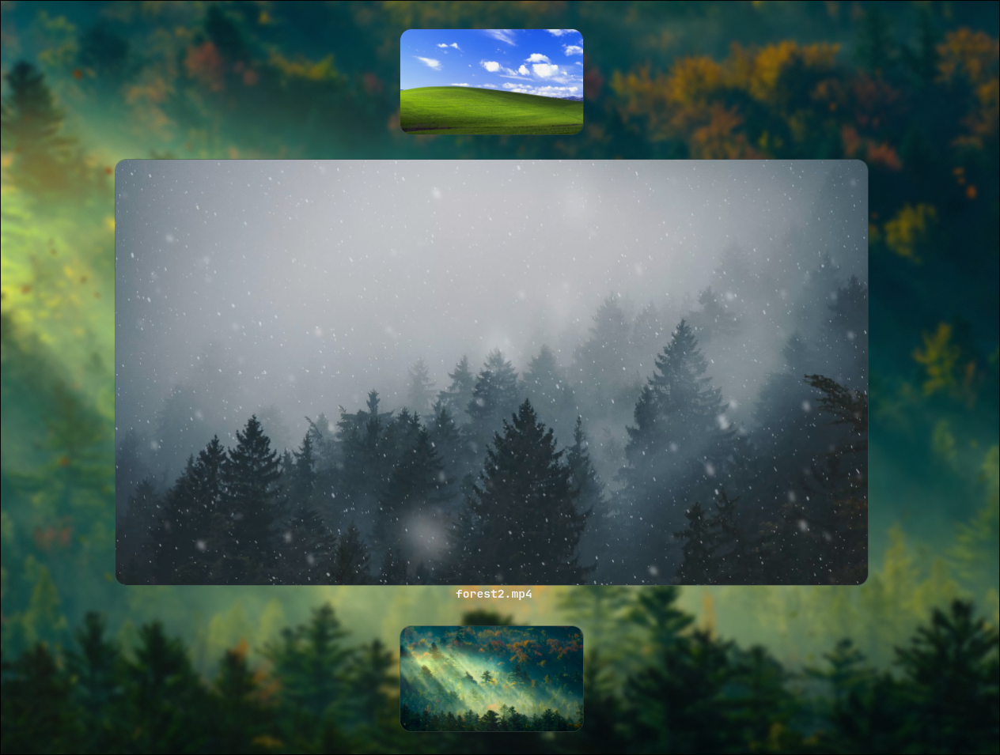

_Wallpaper Selector, images above and below are previews of above and below, use arrow keys to cycle through_

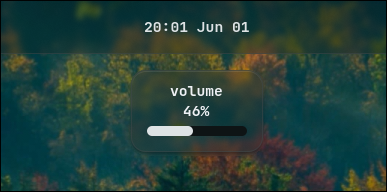<br>
_Volume OSD_

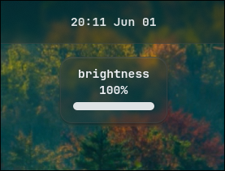<br>
_Brightness OSD_

</details>

### Installing

I'll probably write an install script if people actually use this config

1. Clone the repo: `git clone https://github.com/webdevismypassion34/ags-config.git ~/.config/ags`
2. Cd into it: `cd ~/.config/ags`
3. Install global dependencies: `yay -S aylurs-gtk-shell mpvpaper`, `sudo pacman -S hyprlock playerctl networkmanager bluez-utils swaync wl-clipboard libqalculate fcitx5 kitty upower curl matugen pipewire wireplumber ttf-nerd-fonts-symbols libnotify awww ffmpeg brightnessctl`
4. Install npm dependencies: `npm install`
5. Configure the config in `./config.jsonc`
6. (optional) If you want spotify queue to work in the player popup, create a `./.env` file formatted like this:

```json
{
  "SPOTIFY_CLIENT_ID": "...",
  "SPOTIFY_CLIENT_SECRET": "...",
  "SPOTIFY_REFRESH_TOKEN": "...",
  "SPOTIFY_CACHED_TOKEN": "anything can be put here, as it is overwritten with the cached token",
  "SPOTIFY_CACHE_EXPIRATION": 0
}
```

8. Free the notifications interface if an app is using it (swaync as an example):

```bash
systemctl --user stop swaync.service
systemctl --user mask swaync.service
```

9.  Run ags: `ags run`, or `setsid ags run` to detach from terminal

10. Add keybinds to your Hyprland config for wallpaper and app launcher, any keybinds work:

```conf
bind = $mainMod, D, exec, ags request "toggleLauncher"
bind = $mainMod, W, exec, ags request "toggleWallpaper"
```

11. Add keybinds to your Hyprland config for the on-screen brightness and volume display:

```config
bindel = ,XF86AudioRaiseVolume, exec, wpctl set-volume -l 1 @DEFAULT_AUDIO_SINK@ 5%+ && ags request "updateVolume" $(wpctl get-volume @DEFAULT_AUDIO_SINK@)
bindel = ,XF86AudioLowerVolume, exec, wpctl set-volume @DEFAULT_AUDIO_SINK@ 5%- && ags request "updateVolume" $(wpctl get-volume @DEFAULT_AUDIO_SINK@)

bindel = ,XF86MonBrightnessUp, exec, brightnessctl -e4 -n2 set 5%+ && wpctl set-volume @DEFAULT_AUDIO_SINK@ 5%- && ags request "updateBrightness" $(brightnessctl -m)
bindel = ,XF86MonBrightnessDown, exec, brightnessctl -e4 -n2 set 5%- && ags request "updateBrightness" $(brightnessctl -m)
```

The important parts are `ags request "updateVolume" $(wpctl get-volume @DEFAULT_AUDIO_SINK@)` and `ags request "updateBrightness" $(brightnessctl -m)`

12. (optional) Enable blur by adding this to your Hyprland config:

```conf
layerrule = blur on, match:namespace gtk4-layer-shell
layerrule = ignore_alpha 0.1, match:namespace gtk4-layer-shell
```

### Matugen

1. Make a file at `~/.config/matugen/templates/ags.scss` with this:

```scss
$bg:       {{colors.background.dark.hex}};
$fg:       {{colors.on_background.dark.hex}};
$border:   {{colors.outline_variant.dark.hex}}7f;
$surface0: {{colors.surface_container.dark.hex}};
$surface1: {{colors.surface_container_high.dark.hex}};
$surface2: {{colors.surface_container_highest.dark.hex}};
$overlay0: {{colors.outline_variant.dark.hex}};
$overlay1: {{colors.on_surface_variant.dark.hex}};
$overlay2: {{colors.on_surface.dark.hex}};
$subtext0: {{colors.on_surface_variant.dark.hex}};
$subtext1: {{colors.on_surface.dark.hex}};
```

2. Add this to config.toml:

```toml
[templates.ags]
input_path = '~/.config/matugen/templates/ags.scss'
output_path = '~/.config/ags/matugen.scss'
```
